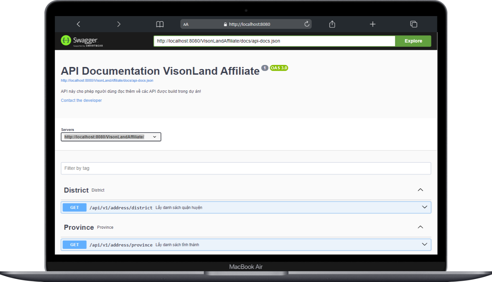

## Setup project

-- cp .env.example .env
-- composer install
-- php artisan key:generate
-- php artisan migrate

-- php artisan ckfinder:download

-- setup stmp .env

<h1>Demo API Doc - Đang cập nhật sang swagger</h1>

<h1>Demo Admin</h1>

